========
Tutorial
========

In this tutorial, we will be using a small provided dataset in the folder GuiliangJun25_tutorial.
These images were taken at beamline 11-ID-B at the Advanced Photon Source.

Materials are located in the GuiliangJun25_tutorial folder:

* 3 images of MA2, 7 images of MA2b, and their metadata files
* Image control file, mask, and calculated profiles of a few phases in the configs subdirectory
* Pipeline output in the folder GuiliangJun25_tutorial_output for those who wish to skip to the UI tutorial

Pipeline
--------

Pipeline UI Overview
~~~~~~~~~~~~~~~~~~~~

Launching the pipeline will open the following window:

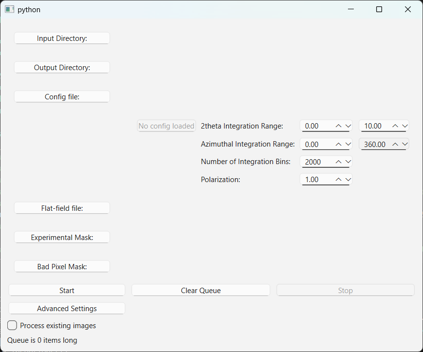

Clicking the buttons on the left will open a file dialog to select the directory or file for each component.
The Input Directory, Output Directory, and Config file are all required.

The Input Directory is the directory containing the images you want to run over.
While the pipeline runs, it will add any new images which enter this directory to the queue to be processed.
Set it to the location of the GuiliangJun25 directory.

The Output Directory is the directory which will hold the output integrals, masks, and other data from the pipeline.
This can be the same directory as the input directory: all of the outputs will be in labelled subdirectories.

The Config file may be either a GSASII .imctrl file or a PyFAI .poni file. If using the latter, please set the 2theta and azimuthal integration ranges,
the number of integration bins, and the polarization in this step.
GSASII .imctrl files contain this information; loading one in will autofill this information.
For this tutorial, the config file is located in GuiliangJun25_tutorial/configs.

The flat-field file is an optional input which contains information about any flat-field corrections which need to be made to the images.
This will not be used in the tutorial.

The Experimental Mask is an image file which contains the overall mask to use based on the experimental setup.
The one provided covers the shadow of the beam stop and was made with the mask_widget tool using a polygon mask.
The image is also located in GuiliangJun25_tutorial/configs.

The Bad Pixel Mask is an optional file masking any known faulty pixels in the detector. This will not be used in the tutorial.
Note that the pipeline will automatically mask out any zero-intensity pixels, which will catch any dead pixels from the detector.

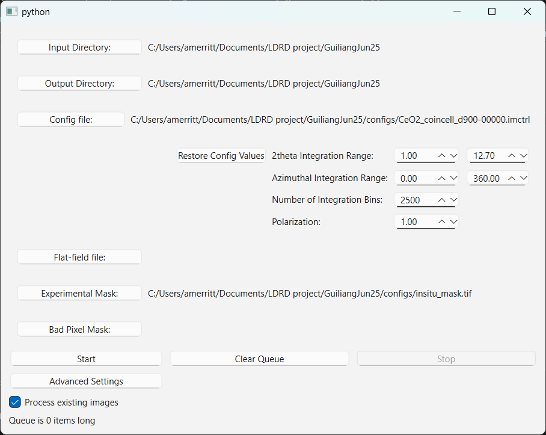

Once these files have been chosen, click on “Process existing images” so the pipeline knows to search the directory for any existing files rather than simply wait for new ones, then click Start.
There will be a delay as the pipeline creates the cache on the first file, then processing will speed up for the rest of the images in the directory.
When the queue size goes back down to zero, click Stop and exit the program.
You may start the UI tutorial while this runs.

Optional: Advanced Settings
~~~~~~~~~~~~~~~~~~~~~~~~~~~

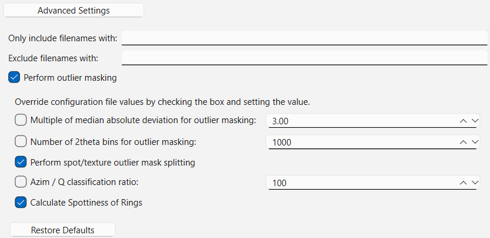

The Advanced Settings option lets you modify other aspects of the pipeline.
Should you wish to change the threshold for certain values or even skip spot/texture classification altogether, you can change those in Advanced Settings.
In cases where you only want to run over a subset of files in a directory, there are also filtering options for including or excluding certain phrases in the file name.
For example, if you type MA2b in the Include section, only those images will be processed.

Results UI
----------

Once you have started the pipeline, it will begin to output image masks, integrals, and other data into subfolders in the Output Directory.
To visualize this data, launch pyqtgraph_layout.py. This will open two windows: the main UI and a small window asking for the Input Directory, Output Directory, and Image Control file (or Config file) again.
Click Browse to give these the same inputs as you gave to the pipeline, then hit Okay.

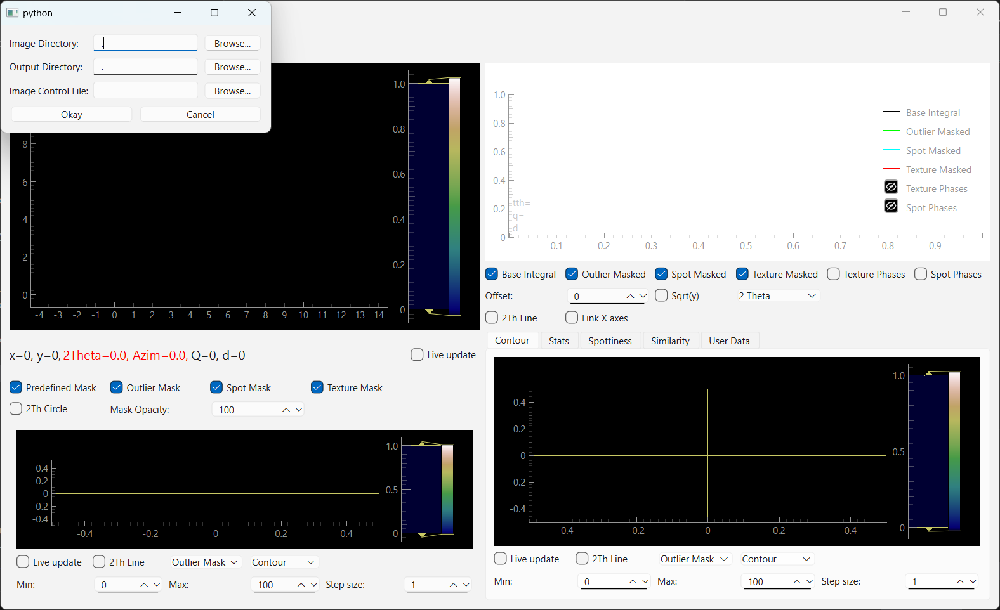

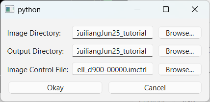

Once you have loaded the directory, the screen will populate with information from the output of the pipeline.
The upper left shows the current image and its masks, the upper right shows the integrated data from the current image and various masks,
the lower left shows a contour plot of all completed integrated lines for this dataset, and the lower right can be toggled to show various pieces of data.

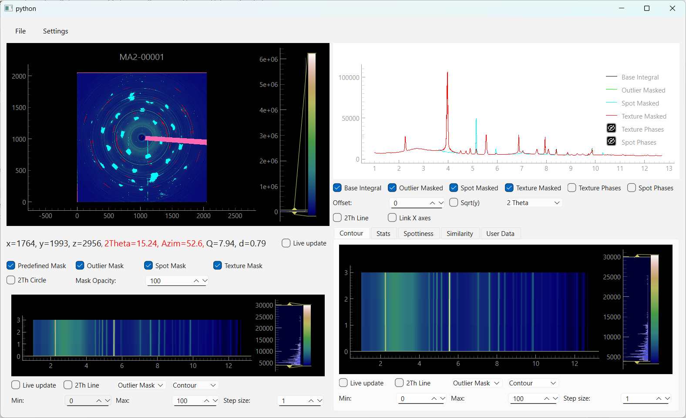

Basic Controls
~~~~~~~~~~~~~~

A useful set of tools to turn on right away are the 2theta lines and circle; these checkboxes can be found on the image, integral, and contour plots.
When toggled on, they will show the 2theta position for the cursor on other windows.

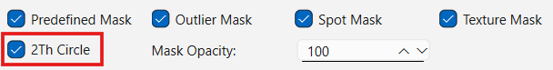

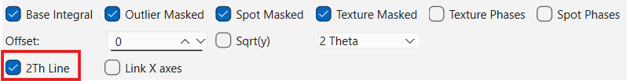

Live View
^^^^^^^^^

Note that both the image window and the contour window have a Live Update option.
Checking the option on the image window will set the image and integral lines to update whenever an image is fully processed by the pipeline.
Checking the option on the contour window will add more integral data to the contour as images are processed.

Image Navigation
^^^^^^^^^^^^^^^^

To navigate between images in a dataset, you may either:

* Press the left or right keys on the keyboard. If this is instead cycling a selection box around checkboxes or the like, click somewhere on the main image before trying again.

* Click on the contour graph. A horizontal yellow line will show the current position in the processed dataset.

Both options for navigating between images will disable the image's Live Update option and show that specific image, its mask, and its integrals in the upper left and right quadrants.

If you have multiple datasets in the directory, you may cycle between them with the up and down keys on the keyboard.

Mask Overlays
^^^^^^^^^^^^^

Each image mask can be toggled on and off with the checkboxes below the main image. The opacity of these masks can also be set.

Contour/Waterfall
^^^^^^^^^^^^^^^^^

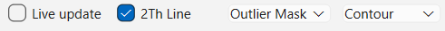

The Contour image can show data from any of the available integrals, including the Base, Outlier Masked, and Spot- and Texture-masked integrals.
You can also set a minimum and maximum value to zoom in on a particular section.
You can also set the step size (recommended for large datasets) to reduce the number of datapoints shown.

These features are also available as a waterfall plot instead; select the dropdown that shows “Contour” and select “Waterfall.” The controls are the same.

Finding Phase Features: User Data
~~~~~~~~~~~~~~~~~~~~~~~~~~~~~~~~~

Ensure the 2theta circle and 2theta line checkboxes below the main image and integral sections are toggled on.
Click on the main image once, then hit the up arrow to swap to a MA2b image.

Take a look at the upper right set of integrals.
These are showing the base integral (with only the predefined beam stop mask applied), the outlier-masked integral, and the spot- and texture-masked integrals.
The visibility of these can be toggled with a set of checkboxes below the image.
To help see where these are overlapping, you can set an offset below the line of toggle checkboxes.

The split into spot- and texture-masked integrals helps classify which phase a particular peak comes from.
If there is a peak in the texture-masked integral but not the spot-masked integral, that contribution must be coming from one of the phases causing single crystal
spots or spotty rings (since the texture-masked integral is not masking them out).
Since this is a bit backwards, another way to look at the contribution to intensity from a particular type of phase is are the Texture Phase and Spot Phase difference integrals,
which show the difference in intensity between the base integral and their named masked integral, respectively.
When there is a peak in the Spot Phases line, this is due to an increase in intensity which was labelled as a spot.

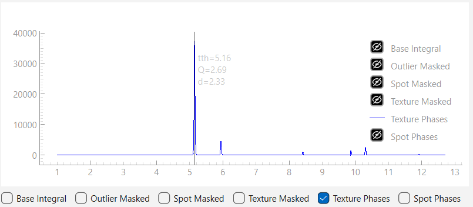

These spot and texture phase difference integrals can help pair peaks with a particular phase.
Toggle on the Texture Phase integral and toggle off all the others.
If you move the cursor around the integral image, you can see that the peaks correspond to the texture-masked areas on the main image.

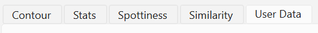

This particular texture is coming from an aluminum phase.
To verify this, go to the User Data tab in the lower-right section.
Click on "Import new data" and import the file in GuiliangJun25_tutorial/configs which has the name Profile Al delta.
This is a calculated profile text file output from CrystalMaker.

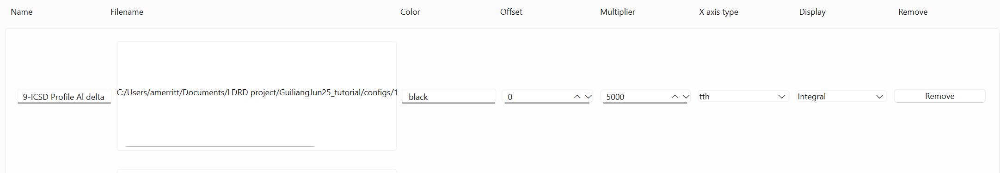

When it is loaded in, set the multiplier to 5000 and set the Display to Integral.
Then click "Update" at the bottom of the window.

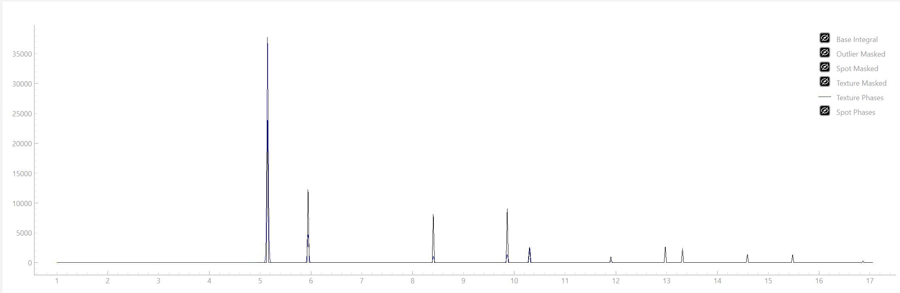

The locations of the calculated peaks of the aluminum phase line up with those of the texture phases in this dataset.

Finding Phase Features: Spot Statistics
~~~~~~~~~~~~~~~~~~~~~~~~~~~~~~~~~~~~~~~

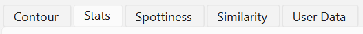

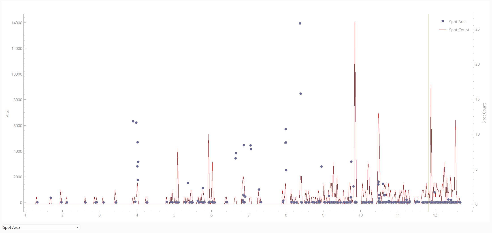

In the lower right quadrant, navigate to the Stats pane.
This will show a scatter plot of the spot areas in the image and a histogram of the spot count.
If you toggle on the spot phases difference line in the top-right quadrant, you can see that the peaks in the spot phases correspond to the peaks in spot area.
Note that the scatter plot 2theta positions are placed at the center of the masked area rather than the brightest point, so the positions will not line up exactly.

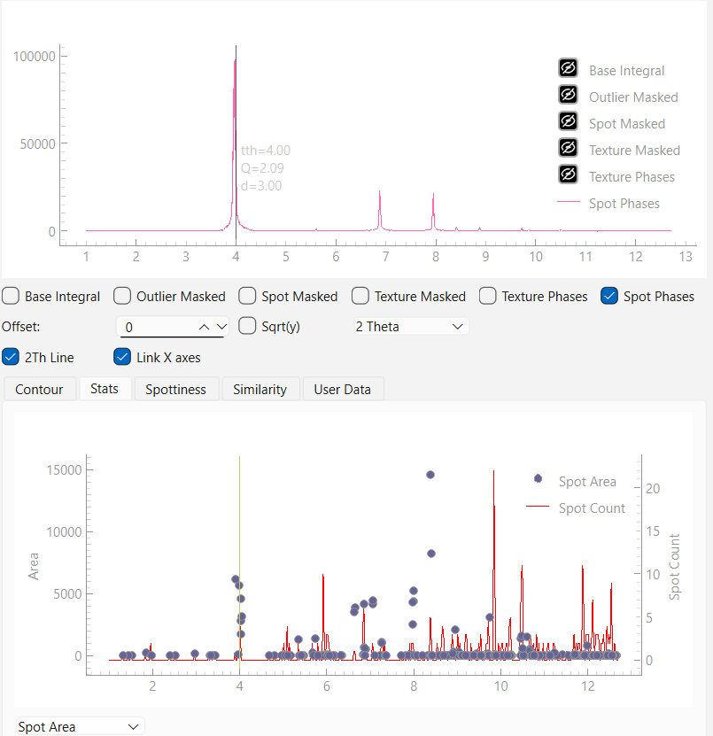

Mask Creation
-------------

The mask creation widget has multiple tools available for creating a predefined experimental mask.
The most basic are the polygon and frame masks, which allow you to define a polygon masking out a particular area.
Spot and Line masks allow for cutting out a circular region or a single line of pixels.
If you load in an image control file, you can also define arcs and rings to cut from the mask.
There is also a threshold mask to cut out any pixels above or below a certain intensity.

Masks can be imported from GSASII and can be exported as both a tiff file and as a GSASII-compatible .immask file.

Setup
~~~~~

When first launched, the mask creation widget will prompt for a test image to use.
Once loaded, there is the option to load in an image control file in order to use the 2 theta threshold, Arc, and Ring mask options; this button is located at the upper right of the window.
The "Load immask" and "Save immask" buttons will allow you to import and export the current mask as an .immask file.
To use the created mask with this software's analysis pipeline, please use the "Save mask" option in the lower right of the window; this will save the mask as a tiff file.

Threshold Masks
~~~~~~~~~~~~~~~

Intensity
^^^^^^^^^

When first loading in an image, the threshold values will autopopulate with values below and above the minimum and maximum intensity, respectively.
These can be adjusted to cut out particular pixels in the image.
Note that, when saving as a tiff file, the threshold value itself is not retained. Only the locations of pixels which did not pass that threshold in the test image will be part of the experimental mask.
Also note that there is a built-in filter in the analysis pipeline to mask out all nonpositive pixels in each image.

2 Theta
^^^^^^^

The 2 theta threshold mask requires an image control file to be loaded. Once loaded, the minimum and maximum values will be set to those of the image.
Adjusting the minimum and maximum 2 theta will mask out those sections of the image.

Object Masks
~~~~~~~~~~~~

Object masks can be added by selecting the type of object in the drop-down menu (defaulting to Polygon) and clicking the "New [Object]"" button.
This will add a new entry to the table for that specific object and allow it to be editable in the image UI.
Some objects, such as polygons, have a setup phase; in these cases, the "New [Object]" button will become "Complete [Object]". More details will be in each section.
When new objects are added, the old ones will become temporarily inactive; to adjust it later, click on the object's name in the table. The vertex handles will reappear and it can be readjusted.
You may also adjust objects using the second column of the table. Information for the format for each object is in its section.
To delete an object, click its name in the table and click the "Delete Selected Object" button.

Polygon Masks
^^^^^^^^^^^^^

Once you hit the New Polygon button, a new row entry will appear in the table on the right.
To add vertices to the polygon, left click the image.
You may click and drag vertices to reposition them. You may also click and drag the center of the polygon to move it.
When you are done adjusting the polygon mask, click the Complete Polygon button.
If you need to adjust it later, click on the name of the object in the table; the vertex handles will reappear and the polygon will be adjustable again.

You can also adjust the exact values of the polygon in the table on the right.
Keep to the following format when adjusting:

``[(x1,y1),(x2,y2),...]``

Then click "Update Objects from Table".

Frame Mask
^^^^^^^^^^

Frame masks are adjusted in the same way polygon masks are, but will mask the exterior of the polygon instead of the interior.
You may only have one frame mask.

Line Mask
^^^^^^^^^

When selecting "New Line", the horizontal or vertical line will appear at the center of the image.
You may click and drag it to the desired location or adjust the postition in the table.
Line masks will cover a single line of pixels.

Point Mask
^^^^^^^^^^

Point masks will create a circular mask. After clicking "New Point", this will initialize at the origin of the image.
You may adjust the center position and radius using the two handles for the point.

To adjust the values using the table, use the following format:

``[center x,center y,radius]``

Arc Mask
^^^^^^^^

Arc masks will mask out a set of values for a given 2 theta and azimuthal range.
After clicking "New Arc", click the image to intitialize the location of the arc.
Dragging the center handle will rotate the arc around the image.
The other four handles define the lower and higher 2 theta and azimuthal values.

The values in the table use the following format:

``[2 theta center,[azim start,azim end],2 theta range]``

Ring Mask
^^^^^^^^^

Ring masks are initialized using two points: the lower and upper 2 theta bounds of the ring.
After clicking "New Ring", click the image twice to initialize the two handles.
These can be dragged to adjust the bounds of the ring.

The values in the table use the following format:

``[2 theta center, 2 theta range]``
